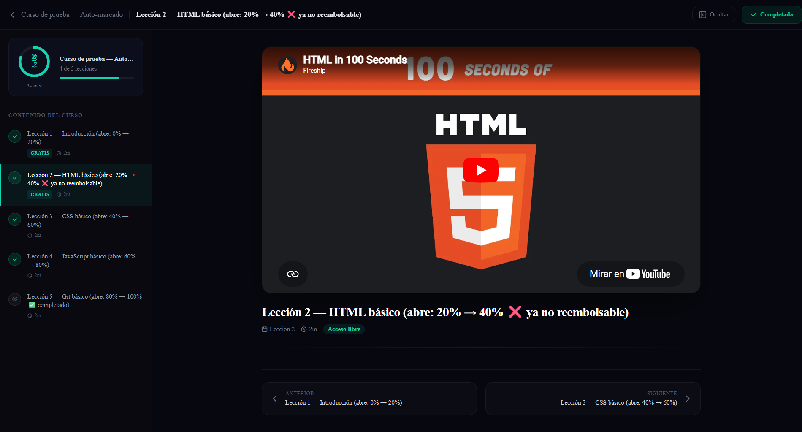
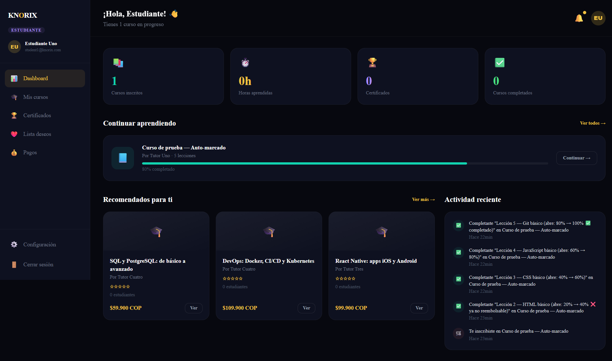
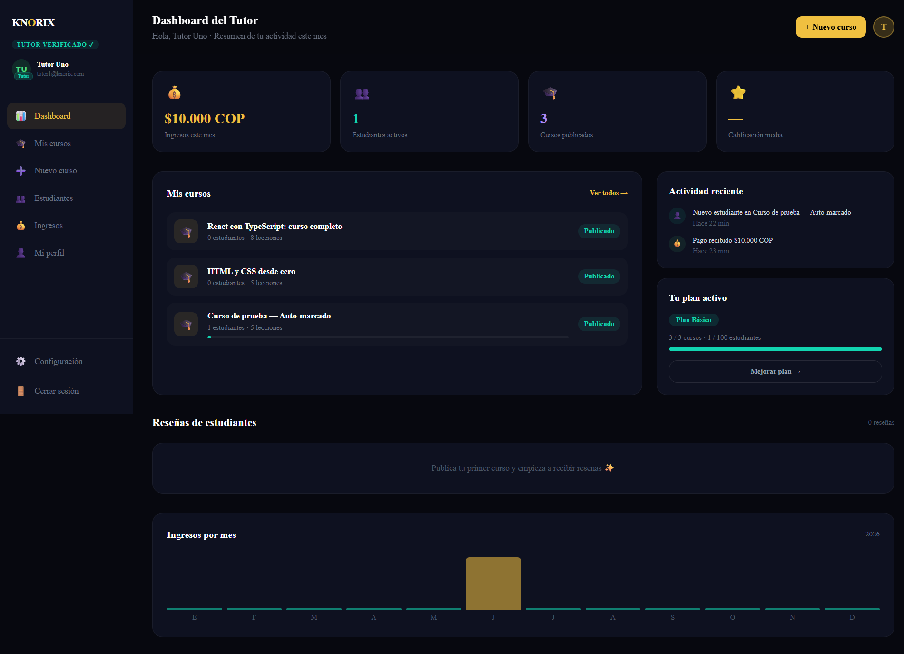
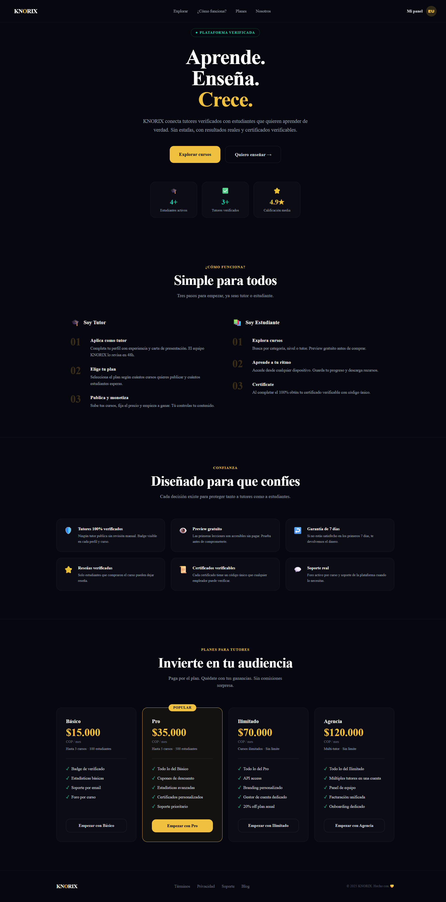
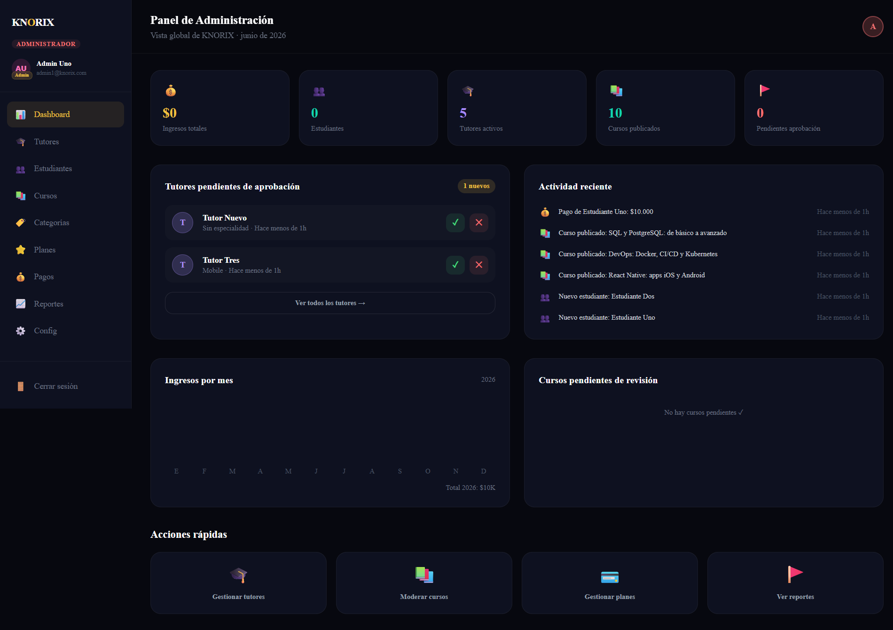

# KNORIX — Plataforma SaaS de Cursos Online

> Conecta tutores verificados con estudiantes. Sin comisiones — el tutor fija el precio y se queda con todo.


---

## ¿Qué es KNORIX?

KNORIX es una plataforma SaaS de cursos online con modelo de suscripción mensual para tutores. A diferencia de plataformas como Udemy (que cobra 50-75% de comisión), en KNORIX el tutor paga una suscripción fija y se queda con el 100% de sus ingresos.

### Características principales

- **Tutores verificados** — revisión manual por admin, badge visible en perfil
- **Preview gratuito** — primeras lecciones accesibles sin pagar
- **Garantía 7 días** — devolución si se solicita dentro del plazo
- **Reseñas verificadas** — solo compradores activos pueden opinar
- **Certificados únicos** — código UUID verificable desde URL pública
- **Progreso automático** — el certificado se genera al completar el 100%
- **Videos seguros** — upload directo a S3, reproducción por CloudFront con URLs firmadas que expiran

### Planes para tutores

| Plan       | Precio/mes   | Cursos    | Estudiantes | Destacado   |
|------------|--------------|-----------|-------------|-------------|
| Básico     | $15.000 COP  | 3         | 100         | —           |
| Pro ⭐      | $35.000 COP  | 10        | 500         | Más popular |
| Ilimitado  | $70.000 COP  | Ilimitado | Sin límite  | —           |
| Agencia 🏢 | $120.000 COP | Ilimitado | Sin límite  | Multi-tutor |

---

## Stack Tecnológico

### Frontend

| Tecnología            | Versión         | Uso                         |
|-----------------------|-----------------|-----------------------------|
| Next.js               | 14 (App Router) | Framework principal         |
| TypeScript            | 5.x             | Lenguaje                    |
| Tailwind CSS          | v4              | Estilos                     |
| ShadCN UI             | latest          | Componentes (Radix + Geist) |
| Zustand               | 4.x             | Estado global               |
| React Hook Form + Zod | latest          | Formularios y validación    |
| ReactPlayer           | latest          | Reproductor de video        |

### Backend

| Tecnología          | Versión | Uso                |
|---------------------|---------|--------------------|
| NestJS              | 11.x    | Framework API REST |
| TypeScript          | 5.x     | Lenguaje           |
| Prisma              | 5.x     | ORM                |
| PostgreSQL          | 18.x    | Base de datos      |
| JWT + Refresh Tokens| —       | Autenticación      |
| AWS SDK v3          | —       | Integración con S3 |

### Infraestructura

| Tecnología   | Uso                                            |
|--------------|------------------------------------------------|
| AWS S3       | Almacenamiento de videos                       |
| AWS CloudFront | CDN — entrega segura con URLs firmadas       |
| AWS IAM      | Permisos de acceso al bucket                   |
| Stripe       | Pagos y suscripciones (Mes 7-8)                |
| Railway      | Deploy del backend                             |
| Vercel       | Deploy del frontend                            |
| GitHub Actions | CI/CD                                        |

---

## Arquitectura

```
knorix/
├── frontend/                      # Next.js 14 — App Router
│   └── src/
│       ├── app/
│       │   └── cursos/[slug]/
│       │       └── lecciones/[lessonId]/page.tsx
│       ├── components/
│       │   └── course/
│       │       ├── VideoPlayer.tsx     ← reproduce con URL firmada de CloudFront
│       │       └── UploadDropzone.tsx  ← sube video directo a S3 desde el navegador
│       └── lib/
│           └── api.ts
└── backend/                       # NestJS API REST
    └── src/
        ├── auth/
        ├── users/
        ├── courses/
        ├── lessons/
        ├── enrollments/
        ├── storage/               ← Nuevo Mes 5-6
        │   ├── storage.service.ts
        │   ├── storage.controller.ts
        │   └── storage.module.ts
        └── prisma/
```

### Roles del sistema

| Rol            | Descripción                                                  |
|----------------|--------------------------------------------------------------|
| **Estudiante** | Explora, se inscribe y accede a cursos. Obtiene certificados.|
| **Tutor**      | Crea y publica cursos, sube videos, gestiona lecciones.      |
| **Admin**      | Aprueba tutores, modera contenido, gestiona planes.          |

---

## Sistema de Videos — Mes 5-6

El diseño central de este módulo: **el backend nunca recibe el archivo de video.**

### Flujo de upload (tutor)

```
Tutor selecciona video
       │
       ▼
GET /storage/upload-url?courseId=xxx&filename=video.mp4
       │
       ▼
Backend genera Presigned URL de S3 (válida 1 hora)
       │
       ▼
Navegador sube el archivo DIRECTAMENTE a S3 via PUT
       │
       ▼
Frontend guarda la key en la lección via PATCH /lessons/:id
```

### Flujo de reproducción (estudiante)

```
Estudiante abre la lección
       │
       ▼
GET /storage/view-url?key=courses/xxx/videos/uuid.mp4
       │
       ▼
Backend genera URL firmada de CloudFront (válida 2 horas)
       │
       ▼
ReactPlayer reproduce desde CloudFront
       │
       ▼
Al llegar al 90% → POST /enrollments/:courseId/lessons/:id/complete
```

### Por qué este diseño

- **Seguridad**: URLs de CloudFront expiran — no se pueden compartir permanentemente.
- **Escalabilidad**: el servidor NestJS no maneja binarios — solo genera URLs.
- **Costo**: S3 + CloudFront es órdenes de magnitud más barato que servir video propio.
- **Progreso automático**: la lección se marca completada al llegar al 90% de reproducción.

---

## Base de Datos — Modelos Prisma

El schema cuenta con **12 modelos** relacionados:

```
User ─── TutorProfile
  │
  ├── Course ─── Category
  │     │
  │     └── Lesson ─── LessonProgress
  │                    (videoUrl: key de S3)
  │
  ├── Enrollment ─── LessonProgress
  ├── Review
  ├── Certificate
  ├── Payment
  ├── Subscription
  └── ForumPost
```

---

## Endpoints de la API

### Auth
```
POST /auth/register     Registro de usuario
POST /auth/login        Login → retorna accessToken
POST /auth/refresh      Renovar token
POST /auth/logout       Cerrar sesión
```

### Courses
```
GET    /courses           Listar cursos (con filtros)
POST   /courses           Crear curso (tutor)
GET    /courses/mine      Mis cursos (tutor autenticado)
GET    /courses/:slug     Detalle de curso
PATCH  /courses/:id       Editar curso
DELETE /courses/:id       Eliminar curso
```

### Lessons
```
POST   /courses/:courseId/lessons        Crear lección
GET    /courses/:courseId/lessons        Listar lecciones
PATCH  /courses/:courseId/lessons/:id    Editar lección
DELETE /courses/:courseId/lessons/:id    Eliminar lección
```

### Enrollments
```
POST /enrollments/:courseId                       Inscribirse
GET  /enrollments/me                              Mis inscripciones
POST /enrollments/:courseId/lessons/:id/complete  Completar lección
GET  /enrollments/:courseId/check                 Verificar inscripción
```

### Storage ← Nuevo Mes 5-6
```
GET /storage/upload-url?courseId=xxx&filename=video.mp4
    → { uploadUrl: "https://s3.amazonaws.com/...", key: "courses/xxx/videos/uuid.mp4" }
    Requiere: Bearer token (tutor autenticado)

GET /storage/view-url?key=courses/xxx/videos/uuid.mp4
    → "https://abc123.cloudfront.net/...?X-Amz-Signature=..."
    Requiere: Bearer token (estudiante inscrito)
```

---

## Snippets incluidos

| Archivo                           | Qué demuestra                                                                     |
|-----------------------------------|-----------------------------------------------------------------------------------|
| `snippets/schema.prisma`          | Diseño de BD relacional — 12 modelos, relaciones 1:N y N:M                        |
| `snippets/auth.service.ts`        | Seguridad — JWT, bcrypt, access + refresh tokens                                  |
| `snippets/api.ts`                 | Integración full stack — cliente centralizado con Bearer token automático         |
| `snippets/enrollments.service.ts` | Lógica de negocio — progreso por lección, cálculo automático, certificado al 100% |
| `snippets/storage.service.ts`     | AWS S3 — generación de presigned URLs de upload y view con SDK v3                 |
| `snippets/upload-dropzone.tsx`    | Upload directo a S3 desde el navegador con barra de progreso (XHR)                |
| `snippets/video-player.tsx`       | Reproducción segura con URL firmada, marcado automático al 90%                    |

---

## Páginas del Frontend

| Ruta                                          | Descripción                             | Estado     |
|-----------------------------------------------|-----------------------------------------|------------|
| `/`                                           | Landing page responsive                 | ✅          |
| `/auth/login`                                 | Login conectado con backend             | ✅          |
| `/auth/registro`                              | Registro en 2 pasos                     | ✅          |
| `/cursos`                                     | Explorador con filtros                  | ✅          |
| `/cursos/[slug]`                              | Detalle de curso                        | ✅          |
| `/cursos/[slug]/lecciones/[lessonId]`         | Reproductor de video + progreso         | ✅ Mes 5-6  |
| `/dashboard/estudiante`                       | Mis cursos y progreso real              | ✅          |
| `/dashboard/tutor`                            | Estadísticas y cursos reales            | ✅          |
| `/dashboard/tutor/cursos/[id]/lecciones/[id]` | Upload de video por lección             | ✅ Mes 5-6  |
| `/dashboard/admin`                            | Métricas y aprobaciones reales          | ✅          |
| `/certificado/[code]`                         | Verificación pública de certificado     | ⏳ Mes 6-7  |
| `/checkout/[courseId]`                        | Flujo de pago Stripe                    | ⏳ Mes 7-8  |

---

## Screenshots

### Landing page


### Planes para tutores


### Catálogo de cursos


### Dashboard del tutor


### Dashboard del estudiante — progreso


### Reproductor de video (estudiante)


### Upload de video por lección (tutor)


### Panel de administración


---

## Estado del Proyecto

```
✅ Mes 1-2   Frontend completo (landing + auth + dashboards)
✅ Mes 3-4   Backend completo (Prisma + Auth + Users + Courses)
✅ Mes 4-5   Integración full stack (Lessons + Enrollments + datos reales)
✅ Mes 5-6   Videos con AWS S3 + CloudFront + VideoPlayer + UploadDropzone
⏳ Mes 6-7   Reseñas + foro + certificados verificables
⏳ Mes 7-8   Pagos con Stripe
⏳ Mes 8-9   Deploy + CI/CD
⏳ Mes 9-12  Beta + lanzamiento público
```

---

## Autor

**Carlos Esteban Rojas Ibarra**  
carlosrojas9928@gmail.com  
[LinkedIn](https://www.linkedin.com/in/carlos-esteban-rojas/) · [GitHub](https://github.com/carlosrojas9928)

---

> Este repositorio contiene fragmentos representativos del proyecto. El código fuente completo es privado.
