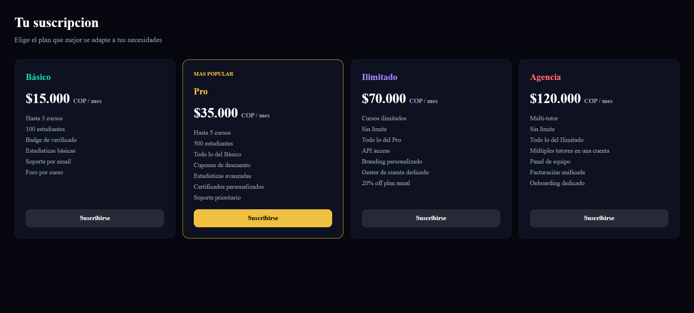
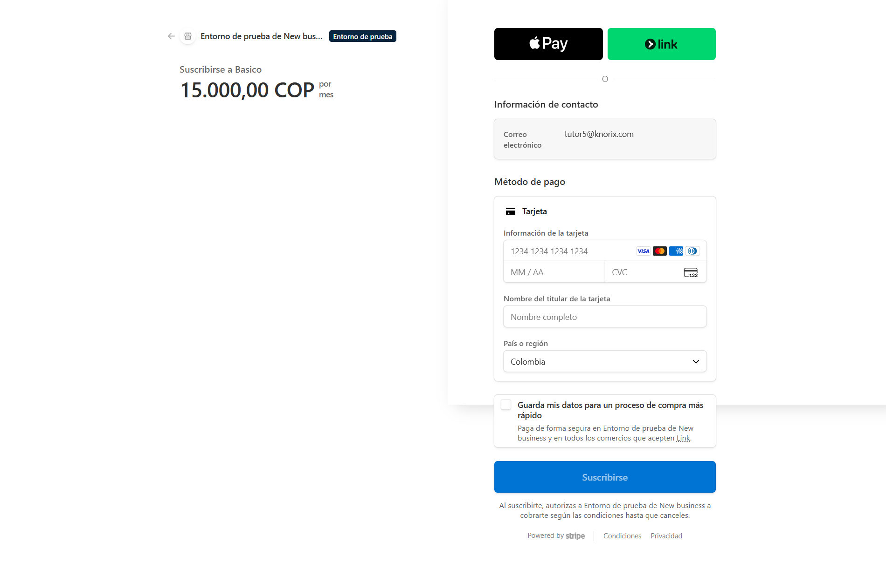
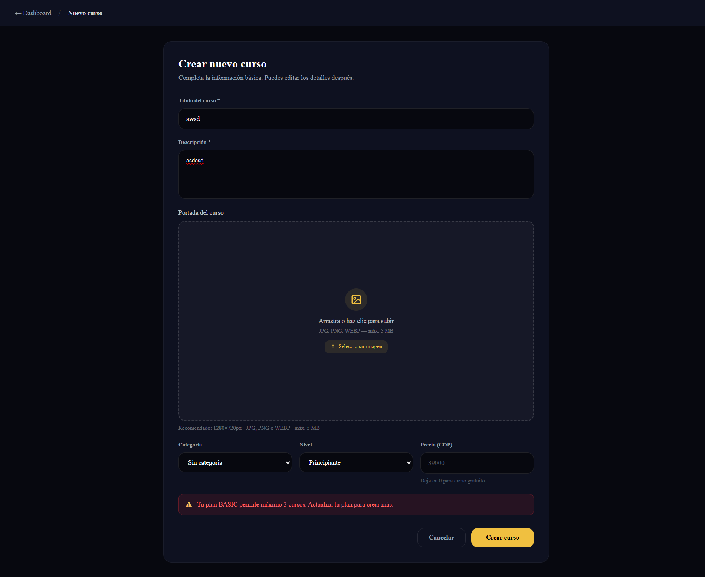
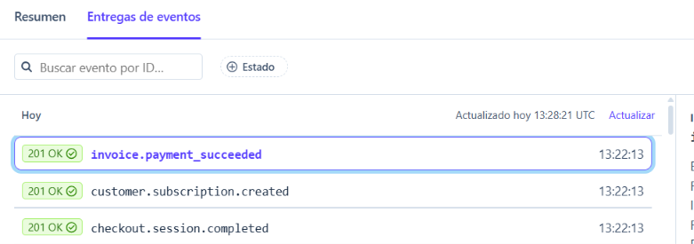

# KNORIX — Plataforma SaaS de Cursos Online

> Conecta tutores verificados con estudiantes. Sin comisiones — el tutor fija el precio y se queda con todo.


---

## ¿Qué es KNORIX?

KNORIX es una plataforma SaaS de cursos online con modelo de suscripción mensual para tutores. A diferencia de plataformas como Udemy (que cobra 50-75% de comisión), en KNORIX el tutor paga una suscripción fija y se queda con el 100% de sus ingresos.

### Características principales

- **Tutores verificados** — revisión manual por admin, badge visible en perfil
- **Preview gratuito** — primeras lecciones accesibles sin pagar
- **Garantía 7 días** — devolución si se solicita dentro del plazo
- **Reseñas verificadas** — solo compradores activos pueden opinar
- **Certificados únicos** — código UUID verificable desde URL pública sin autenticación
- **Progreso automático** — el certificado se genera al completar el 100%
- **Videos seguros** — upload directo a S3, reproducción por CloudFront con URLs firmadas
- **Suscripciones recurrentes** — 4 planes con Stripe, webhooks y validación de límites en tiempo real

### Planes para tutores

| Plan       | Precio/mes   | Cursos    | Estudiantes | Destacado   |
|------------|--------------|-----------|-------------|-------------|
| Básico     | $15.000 COP  | 3         | 100         | —           |
| Pro ⭐      | $35.000 COP  | 5         | 500         | Más popular |
| Ilimitado  | $70.000 COP  | Ilimitado | Sin límite  | —           |
| Agencia 🏢 | $120.000 COP | Ilimitado | Sin límite  | Multi-tutor |

---

## Stack Tecnológico

### Frontend

| Tecnología            | Versión         | Uso                         |
|-----------------------|-----------------|-----------------------------|
| Next.js               | 14 (App Router) | Framework principal         |
| TypeScript            | 5.x             | Lenguaje                    |
| Tailwind CSS          | v4              | Estilos                     |
| ShadCN UI             | latest          | Componentes (Radix + Geist) |
| Zustand               | 4.x             | Estado global               |
| React Hook Form + Zod | latest          | Formularios y validación    |
| ReactPlayer           | latest          | Reproductor de video        |

### Backend

| Tecnología           | Versión | Uso                      |
|----------------------|---------|--------------------------|
| NestJS               | 11.x    | Framework API REST       |
| TypeScript           | 5.x     | Lenguaje                 |
| Prisma               | 5.x     | ORM                      |
| PostgreSQL           | 18.x    | Base de datos            |
| JWT + Refresh Tokens | —       | Autenticación            |
| AWS SDK v3           | —       | Integración con S3       |
| Stripe SDK           | —       | Suscripciones y webhooks |

### Infraestructura

| Tecnología     | Uso                                      |
|----------------|------------------------------------------|
| AWS S3         | Almacenamiento de videos                 |
| AWS CloudFront | CDN — entrega segura con URLs firmadas   |
| Stripe         | Suscripciones recurrentes + webhooks     |
| Railway        | Deploy del backend                       |
| Vercel         | Deploy del frontend                      |
| GitHub Actions | CI/CD                                    |

---

## Arquitectura

```
knorix/
├── frontend/                        # Next.js 14 — App Router
│   └── src/
│       ├── app/
│       │   ├── cursos/[slug]/page.tsx
│       │   ├── certificado/[code]/page.tsx
│       │   └── dashboard/tutor/
│       │       └── suscripcion/page.tsx       ← Nuevo Mes 7-8
│       ├── components/
│       │   ├── course/
│       │   │   ├── VideoPlayer.tsx
│       │   │   └── UploadDropzone.tsx
│       │   └── reviews/
│       │       └── ReviewForm.tsx
│       └── lib/
│           └── api.ts                         ← subscriptionsApi agregado
└── backend/                         # NestJS API REST
    └── src/
        ├── auth/
        ├── users/
        ├── courses/                           ← canCreateCourse() integrado
        ├── lessons/
        ├── enrollments/                       ← canEnrollStudent() integrado
        ├── storage/
        ├── reviews/
        ├── certificates/
        ├── forum/
        ├── payments/
        ├── subscriptions/                     ← Nuevo Mes 7-8
        │   ├── subscriptions.service.ts
        │   ├── subscriptions.controller.ts
        │   └── subscriptions.module.ts
        └── prisma/
```

### Roles del sistema

| Rol            | Descripción                                                    |
|----------------|----------------------------------------------------------------|
| **Estudiante** | Explora, se inscribe, accede a cursos y deja reseñas.          |
| **Tutor**      | Paga suscripción, crea cursos, sube videos, gestiona lecciones.|
| **Admin**      | Aprueba tutores, modera contenido, gestiona planes.            |

---

## Sistema de Suscripciones — Mes 7-8

### Flujo de suscripción del tutor

```
Tutor elige plan en /dashboard/tutor/suscripcion
       │
       ▼
POST /subscriptions/checkout { plan: "PRO" }
       │
       ▼
Backend crea sesión en Stripe Checkout
       │
       ▼
Tutor paga con tarjeta en Stripe (15.000 COP/mes)
       │
       ▼
Stripe envía webhook → POST /subscriptions/webhook
       │
       ▼
Backend verifica firma HMAC-SHA256
       │
       ▼
Prisma upsert → Subscription activada en BD
       │
       ▼
Tutor regresa al dashboard con plan activo
```

### Validación de límites en tiempo real

```
Tutor intenta crear un curso
       │
       ▼
CoursesService.create()
       │
       ▼
canCreateCourse() → consulta Subscription + cuenta cursos actuales
       │
       ├── Plan activo + dentro del límite → ✅ continúa
       └── Sin plan o límite superado      → ❌ 400 Bad Request
           "Tu plan BASIC permite máximo 3 cursos."
```

### Eventos de webhook manejados

| Evento                            | Acción en BD                        |
|-----------------------------------|-------------------------------------|
| `checkout.session.completed`      | Delegado a PaymentsService          |
| `customer.subscription.created`   | upsert Subscription → ACTIVE        |
| `customer.subscription.updated`   | upsert Subscription → actualiza plan|
| `customer.subscription.deleted`   | updateMany → CANCELLED              |
| `invoice.payment_succeeded`       | Crea registro en Payment            |
| `invoice.payment_failed`          | updateMany → PAST_DUE               |

> Los planes se leen dinámicamente desde la BD por `stripePriceId` — sin mapas hardcodeados.

---

## Base de Datos — Modelos Prisma

El schema cuenta con **12 modelos** relacionados:

```
User ─── TutorProfile
  │
  ├── Course ─── Category
  │     │
  │     └── Lesson ─── LessonProgress
  │                    (videoUrl: key de S3)
  │
  ├── Enrollment ─── LessonProgress
  ├── Review
  ├── Certificate
  ├── Payment
  ├── Subscription        ← status: ACTIVE | PENDING | CANCELLED | PAST_DUE
  ├── ForumPost
  └── Plan                ← stripePriceId dinámico
```

---

## Endpoints de la API

### Auth
```
POST /auth/register     Registro de usuario
POST /auth/login        Login → retorna accessToken
POST /auth/refresh      Renovar token
POST /auth/logout       Cerrar sesión
```

### Courses
```
GET    /courses           Listar cursos (con filtros)
POST   /courses           Crear curso — valida límite del plan activo
GET    /courses/mine      Mis cursos (tutor autenticado)
GET    /courses/:slug     Detalle de curso
PATCH  /courses/:id       Editar curso
DELETE /courses/:id       Eliminar curso
```

### Enrollments
```
POST /enrollments/:courseId                       Inscribirse — valida límite del plan
GET  /enrollments/me                              Mis inscripciones
POST /enrollments/:courseId/lessons/:id/complete  Completar lección
GET  /enrollments/:courseId/check                 Verificar inscripción
```

### Storage
```
GET /storage/upload-url?courseId=xxx&filename=video.mp4
    → { uploadUrl, key }   (tutor autenticado)

GET /storage/view-url?key=courses/xxx/videos/uuid.mp4
    → URL firmada CloudFront 2h   (estudiante inscrito)
```

### Reviews
```
POST   /reviews/:courseId   Crear reseña (estudiante inscrito)
GET    /reviews/:courseId   Listar reseñas del curso
PATCH  /reviews/:courseId   Editar mi reseña
DELETE /reviews/:courseId   Eliminar mi reseña
```

### Certificates
```
GET /certificates/me        Mis certificados (autenticado)
GET /certificates/:code     Verificar certificado (público — sin auth)
```

### Subscriptions ← Nuevo Mes 7-8
```
POST /subscriptions/checkout        Crear sesión de pago en Stripe
GET  /subscriptions/me              Plan activo + uso actual
POST /subscriptions/cancel          Cancelar al final del periodo
POST /subscriptions/billing-portal  Portal de facturación de Stripe
POST /subscriptions/webhook         Eventos de Stripe (sin auth)
```

---

## Snippets incluidos

| Archivo                             | Qué demuestra                                                                      |
|-------------------------------------|------------------------------------------------------------------------------------|
| `snippets/schema.prisma`            | Diseño de BD relacional — 12 modelos, relaciones 1:N y N:M                         |
| `snippets/auth.service.ts`          | Seguridad — JWT, bcrypt, access + refresh tokens                                   |
| `snippets/api.ts`                   | Integración full stack — cliente centralizado con Bearer token automático          |
| `snippets/enrollments.service.ts`   | Lógica de negocio — progreso por lección, cálculo automático, certificado al 100%  |
| `snippets/storage.service.ts`       | AWS S3 — generación de presigned URLs con SDK v3                                   |
| `snippets/upload-dropzone.tsx`      | Upload directo a S3 desde el navegador con barra de progreso                       |
| `snippets/video-player.tsx`         | Reproducción segura con URL firmada, marcado automático al 90%                     |
| `snippets/reviews.service.ts`       | Reseñas verificadas — validación de inscripción + recálculo de rating              |
| `snippets/certificates.service.ts`  | Certificado público — endpoint sin auth, verificación por UUID                     |
| `snippets/forum.service.ts`         | Foro por curso — jerarquía de eliminación y paginación                             |
| `snippets/subscriptions.service.ts` | Stripe — checkout, webhooks HMAC, cancelación y validación de límites por plan     |

---

## Páginas del Frontend

| Ruta                                          | Descripción                         | Estado    |
|-----------------------------------------------|-------------------------------------|-----------|
| `/`                                           | Landing page responsive             | ✅         |
| `/auth/login`                                 | Login conectado con backend         | ✅         |
| `/auth/registro`                              | Registro en 2 pasos                 | ✅         |
| `/cursos`                                     | Explorador con filtros              | ✅         |
| `/cursos/[slug]`                              | Detalle de curso + reseñas          | ✅         |
| `/cursos/[slug]/lecciones/[lessonId]`         | Reproductor de video + progreso     | ✅         |
| `/certificado/[code]`                         | Verificación pública de certificado | ✅         |
| `/dashboard/estudiante`                       | Mis cursos y progreso real          | ✅         |
| `/dashboard/tutor`                            | Estadísticas y cursos reales        | ✅         |
| `/dashboard/tutor/suscripcion`                | Planes, plan activo y uso real      | ✅ Mes 7-8 |
| `/dashboard/tutor/cursos/[id]/lecciones/[id]` | Upload de video por lección         | ✅         |
| `/dashboard/admin`                            | Métricas y aprobaciones reales      | ✅         |
| `/checkout/[courseId]`                        | Flujo de pago Stripe (estudiantes)  | ⏳ Mes 8-9 |

---

## Screenshots

### Página de suscripción — grid de 4 planes


### Stripe Checkout — página de pago 15.000 COP/mes


### Error 400 — límite del plan superado


### Stripe Dashboard — webhooks recibidos exitosamente


---

## Estado del Proyecto

```
✅ Mes 1-2   Frontend completo (landing + auth + dashboards)
✅ Mes 3-4   Backend completo (Prisma + Auth + Users + Courses)
✅ Mes 4-5   Integración full stack (Lessons + Enrollments + datos reales)
✅ Mes 5-6   Videos con AWS S3 + CloudFront + VideoPlayer + UploadDropzone
✅ Mes 6-7   Reseñas verificadas + foro + certificados con UUID verificable
✅ Mes 7-8   Suscripciones recurrentes con Stripe + webhooks + validación de límites
⏳ Mes 8-9   Pagos de estudiantes (checkout por curso + reembolsos)
⏳ Mes 9-10  Deploy + CI/CD
⏳ Mes 10-12 Beta + lanzamiento público
```

---

## Autor

**Carlos Esteban Rojas Ibarra**  
carlosrojas9928@gmail.com  
[LinkedIn](https://www.linkedin.com/in/carlos-esteban-rojas/) · [GitHub](https://github.com/carlosrojas9928)

---

> Este repositorio contiene fragmentos representativos del proyecto. El código fuente completo es privado.