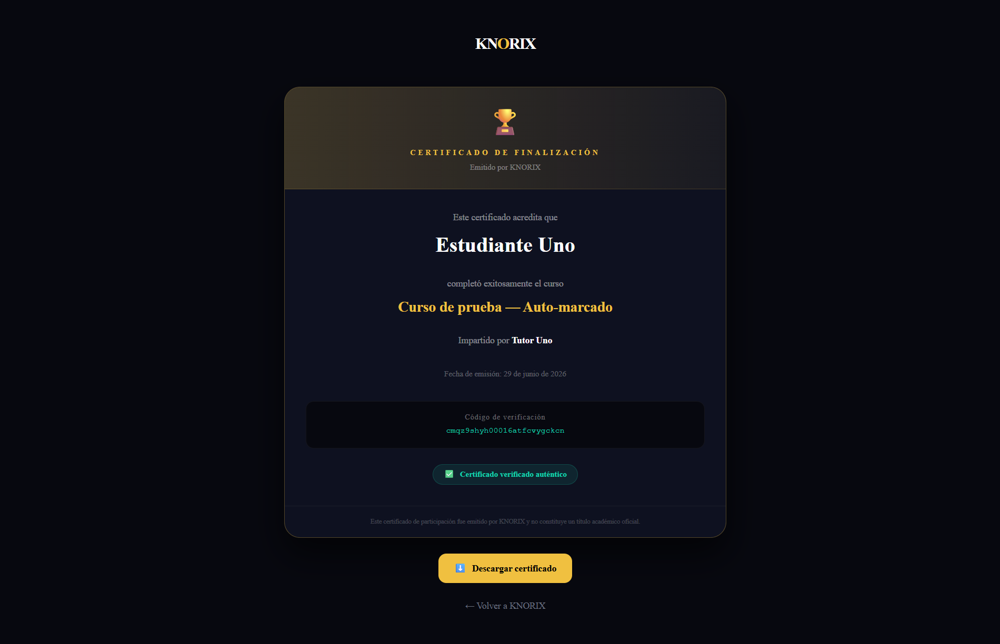
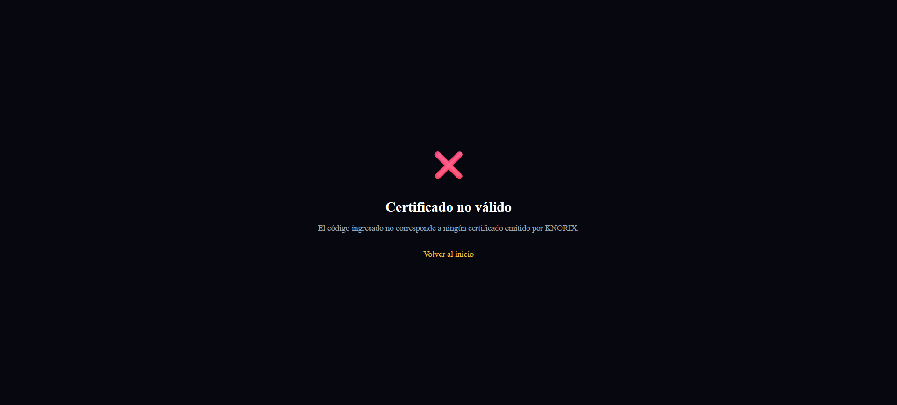
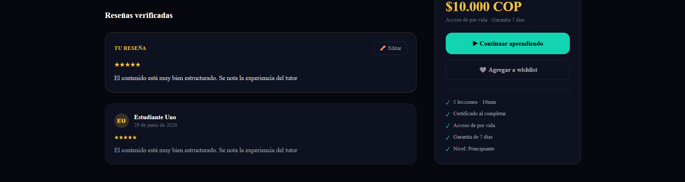
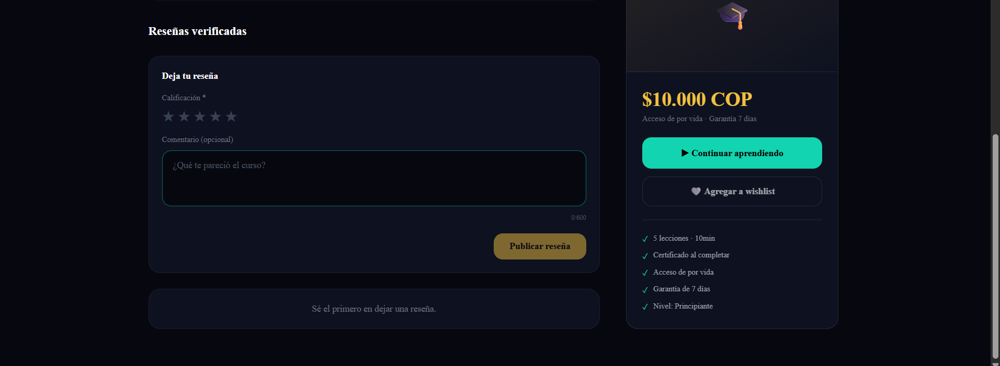

# KNORIX — Plataforma SaaS de Cursos Online

> Conecta tutores verificados con estudiantes. Sin comisiones — el tutor fija el precio y se queda con todo.


---

## ¿Qué es KNORIX?

KNORIX es una plataforma SaaS de cursos online con modelo de suscripción mensual para tutores. A diferencia de plataformas como Udemy (que cobra 50-75% de comisión), en KNORIX el tutor paga una suscripción fija y se queda con el 100% de sus ingresos.

### Características principales

- **Tutores verificados** — revisión manual por admin, badge visible en perfil
- **Preview gratuito** — primeras lecciones accesibles sin pagar
- **Garantía 7 días** — devolución si se solicita dentro del plazo
- **Reseñas verificadas** — solo compradores activos pueden opinar
- **Certificados únicos** — código UUID verificable desde URL pública sin autenticación
- **Progreso automático** — el certificado se genera al completar el 100%
- **Videos seguros** — upload directo a S3, reproducción por CloudFront con URLs firmadas

### Planes para tutores

| Plan       | Precio/mes   | Cursos    | Estudiantes | Destacado   |
|------------|--------------|-----------|-------------|-------------|
| Básico     | $15.000 COP  | 3         | 100         | —           |
| Pro ⭐      | $35.000 COP  | 10        | 500         | Más popular |
| Ilimitado  | $70.000 COP  | Ilimitado | Sin límite  | —           |
| Agencia 🏢 | $120.000 COP | Ilimitado | Sin límite  | Multi-tutor |

---

## Stack Tecnológico

### Frontend

| Tecnología            | Versión         | Uso                         |
|-----------------------|-----------------|-----------------------------|
| Next.js               | 14 (App Router) | Framework principal         |
| TypeScript            | 5.x             | Lenguaje                    |
| Tailwind CSS          | v4              | Estilos                     |
| ShadCN UI             | latest          | Componentes (Radix + Geist) |
| Zustand               | 4.x             | Estado global               |
| React Hook Form + Zod | latest          | Formularios y validación    |
| ReactPlayer           | latest          | Reproductor de video        |

### Backend

| Tecnología           | Versión | Uso                |
|----------------------|---------|--------------------|
| NestJS               | 11.x    | Framework API REST |
| TypeScript           | 5.x     | Lenguaje           |
| Prisma               | 5.x     | ORM                |
| PostgreSQL           | 18.x    | Base de datos      |
| JWT + Refresh Tokens | —       | Autenticación      |
| AWS SDK v3           | —       | Integración con S3 |

### Infraestructura

| Tecnología     | Uso                                       |
|----------------|-------------------------------------------|
| AWS S3         | Almacenamiento de videos                  |
| AWS CloudFront | CDN — entrega segura con URLs firmadas    |
| Stripe         | Pagos y suscripciones (Mes 7-8)           |
| Railway        | Deploy del backend                        |
| Vercel         | Deploy del frontend                       |
| GitHub Actions | CI/CD                                     |

---

## Arquitectura

```
knorix/
├── frontend/                      # Next.js 14 — App Router
│   └── src/
│       ├── app/
│       │   ├── cursos/[slug]/page.tsx         ← detalle con reseñas
│       │   └── certificado/[code]/page.tsx    ← verificación pública ← Nuevo Mes 6-7
│       ├── components/
│       │   ├── course/
│       │   │   ├── VideoPlayer.tsx
│       │   │   └── UploadDropzone.tsx
│       │   └── reviews/
│       │       └── ReviewForm.tsx             ← Nuevo Mes 6-7
│       └── lib/
│           └── api.ts
└── backend/                       # NestJS API REST
    └── src/
        ├── auth/
        ├── users/
        ├── courses/
        ├── lessons/
        ├── enrollments/
        ├── storage/
        ├── reviews/               ← Nuevo Mes 6-7
        │   ├── reviews.service.ts
        │   ├── reviews.controller.ts
        │   └── reviews.module.ts
        ├── certificates/          ← Nuevo Mes 6-7
        │   ├── certificates.service.ts
        │   ├── certificates.controller.ts
        │   └── certificates.module.ts
        └── prisma/
```

### Roles del sistema

| Rol            | Descripción                                                  |
|----------------|--------------------------------------------------------------|
| **Estudiante** | Explora, se inscribe, accede a cursos y deja reseñas.        |
| **Tutor**      | Crea y publica cursos, sube videos, gestiona lecciones.      |
| **Admin**      | Aprueba tutores, modera contenido, gestiona planes.          |

---

## Novedades Mes 6-7

### 1. Sistema de reseñas verificadas

Solo estudiantes inscritos pueden dejar reseña — validado contra la tabla `Enrollment` antes de permitir el POST. Una reseña por estudiante por curso. Cada nueva reseña recalcula automáticamente el rating promedio del curso con `Prisma aggregate()`.

### 2. Certificados con UUID verificable públicamente

El certificado se genera automáticamente al completar el 100% del progreso. Lo nuevo: un endpoint público `GET /certificates/:code` que **no requiere autenticación** — cualquier empresa o persona puede verificar si el certificado es legítimo directamente desde una URL, sin crear cuenta en KNORIX.

---

## Endpoints de la API

### Auth
```
POST /auth/register     Registro de usuario
POST /auth/login        Login → retorna accessToken
POST /auth/refresh      Renovar token
POST /auth/logout       Cerrar sesión
```

### Courses
```
GET    /courses           Listar cursos (con filtros)
POST   /courses           Crear curso (tutor)
GET    /courses/mine      Mis cursos (tutor autenticado)
GET    /courses/:slug     Detalle de curso
PATCH  /courses/:id       Editar curso
DELETE /courses/:id       Eliminar curso
```

### Enrollments
```
POST /enrollments/:courseId                       Inscribirse
GET  /enrollments/me                              Mis inscripciones
POST /enrollments/:courseId/lessons/:id/complete  Completar lección
GET  /enrollments/:courseId/check                 Verificar inscripción
```

### Storage
```
GET /storage/upload-url?courseId=xxx&filename=video.mp4
    → { uploadUrl, key }   (tutor autenticado)

GET /storage/view-url?key=courses/xxx/videos/uuid.mp4
    → URL firmada CloudFront 2h   (estudiante inscrito)
```

### Reviews ← Nuevo Mes 6-7
```
POST   /reviews/:courseId        Crear reseña (estudiante inscrito)
GET    /reviews/:courseId        Listar reseñas del curso
PATCH  /reviews/:courseId        Editar mi reseña
DELETE /reviews/:courseId        Eliminar mi reseña
```

### Certificates ← Nuevo Mes 6-7
```
GET /certificates/me             Mis certificados (autenticado)
GET /certificates/:code          Verificar certificado (público — sin auth)
```

---

## Snippets incluidos

| Archivo                           | Qué demuestra                                                                      |
|-----------------------------------|------------------------------------------------------------------------------------|
| `snippets/schema.prisma`          | Diseño de BD relacional — 12 modelos, relaciones 1:N y N:M                         |
| `snippets/auth.service.ts`        | Seguridad — JWT, bcrypt, access + refresh tokens                                   |
| `snippets/api.ts`                 | Integración full stack — cliente centralizado con Bearer token automático          |
| `snippets/enrollments.service.ts` | Lógica de negocio — progreso por lección, cálculo automático, certificado al 100%  |
| `snippets/storage.service.ts`     | AWS S3 — generación de presigned URLs con SDK v3                                   |
| `snippets/upload-dropzone.tsx`    | Upload directo a S3 desde el navegador con barra de progreso                       |
| `snippets/video-player.tsx`       | Reproducción segura con URL firmada, marcado automático al 90%                     |
| `snippets/reviews.service.ts`     | Reseñas verificadas — validación de inscripción + recálculo de rating con aggregate|
| `snippets/certificates.service.ts`| Certificado público — endpoint sin auth, verificación por UUID                     |

---

## Páginas del Frontend

| Ruta                                          | Descripción                         | Estado    |
|-----------------------------------------------|-------------------------------------|-----------|
| `/`                                           | Landing page responsive             | ✅         |
| `/auth/login`                                 | Login conectado con backend         | ✅         |
| `/auth/registro`                              | Registro en 2 pasos                 | ✅         |
| `/cursos`                                     | Explorador con filtros              | ✅         |
| `/cursos/[slug]`                              | Detalle de curso + reseñas          | ✅ Mes 6-7 |
| `/cursos/[slug]/lecciones/[lessonId]`         | Reproductor de video + progreso     | ✅ Mes 5-6 |
| `/certificado/[code]`                         | Verificación pública de certificado | ✅ Mes 6-7 |
| `/dashboard/estudiante`                       | Mis cursos y progreso real          | ✅         |
| `/dashboard/tutor`                            | Estadísticas y cursos reales        | ✅         |
| `/dashboard/tutor/cursos/[id]/lecciones/[id]` | Upload de video por lección         | ✅ Mes 5-6 |
| `/dashboard/admin`                            | Métricas y aprobaciones reales      | ✅         |
| `/checkout/[courseId]`                        | Flujo de pago Stripe                | ⏳ Mes 7-8 |

---

## Screenshots

### Certificado verificado — válido


### Certificado no válido — validación del sistema


### Reseñas verificadas en página del curso


### Formulario de reseña con calificación por estrellas


---

## Estado del Proyecto

```
✅ Mes 1-2   Frontend completo (landing + auth + dashboards)
✅ Mes 3-4   Backend completo (Prisma + Auth + Users + Courses)
✅ Mes 4-5   Integración full stack (Lessons + Enrollments + datos reales)
✅ Mes 5-6   Videos con AWS S3 + CloudFront + VideoPlayer + UploadDropzone
✅ Mes 6-7   Reseñas verificadas + certificados con UUID verificable públicamente
⏳ Mes 7-8   Pagos con Stripe
⏳ Mes 8-9   Deploy + CI/CD
⏳ Mes 9-12  Beta + lanzamiento público
```

---

## Autor

**Carlos Esteban Rojas Ibarra**  
carlosrojas9928@gmail.com  
[LinkedIn](https://www.linkedin.com/in/carlos-esteban-rojas/) · [GitHub](https://github.com/carlosrojas9928)

---

> Este repositorio contiene fragmentos representativos del proyecto. El código fuente completo es privado.
